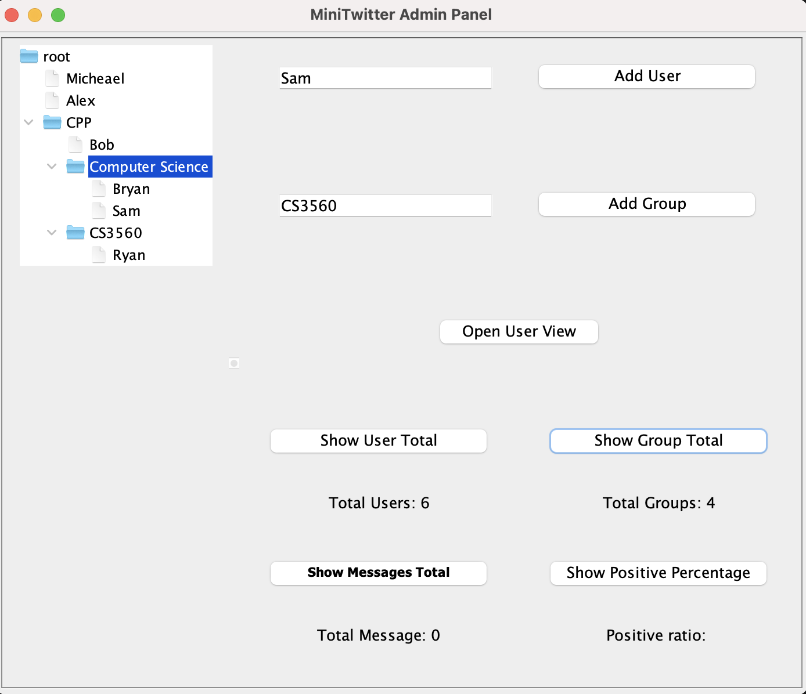

# CS 3560 Object-Oriented Design and Programming (Fall 2023)
A project hub for all the CS3560 assignments.

|**Course number:** | CS 3560                      |
|-------------------|------------------------------|
|**Instructor:**    | Yu Sun                       |
|**Email:**         | ysun@cpp.edu                 |
|**Class Times:**   | TTh 10:00-11:15 am           |
|**Class Location:**| 163-2015                     |

## Project 2: Mini Twitter

The Singleton Pattern was used to create one instance of the Admin Panel to act as a manager control in the main driver program, App.java. Composite Pattern was used to add user and groups to the tree and keep track of the group directory using the Java Swing UI Library. The Composite Pattern ensured that unique users and groups were added to the program and kept track of the tree hiearchy structure. Visitor Pattern is used to keep track of the statisitical information with the users and groups. Observer pattern was used to add, remove, and update the list of followerers for the user to update the news feed for when new tweets were sent.

### Project Demo
<a href="https://youtu.be/DS9L06Vo7pw" target="_blank">CS3560 Project 2 Demo - Mini Twitter</a>

### Problem Description
In this programming assignment, you will build a Java­based Mini Twitter with graphical user interface (GUI) using Java Swing. This is going to be a pure desktop program, without web or mobile components. The goal of this assignment is to let you experience how to apply design patterns to build extensible software systems.

The basic functions of the system include:
1. There is a centralized admin control panel to create users and user groups.
2. A user has 1) an unique ID; 2) a list of user IDs that are following this user (followers);
3) a list of user IDs being followed by this user (followings); 4) a news feed list containing a list of Twitter messages.
3. A user group has an unique ID, which can be used to group users. A user group can contain any number of users. The same user can only be included in one group. Of course, a user group can contain other user groups recursively. There is always a root group called Root to include everything.
4. Users can choose to follow other users (not user groups) by providing the target user ID. Unfollow is not required.
5. Users can also post a short Tweet message (a String), so that all the followers can see this message in their news feed lists. Of course, the user can also see his or her own posted messages.
6. A few analysis features are needed in the admin control panel: 1) output the total number of users; 2) output the total number of groups; 3) output the total number of Tweet messages in all the users’ news feed; 4) output the percentage of the positive Tweet messages in all the users’ news feed (the message containing positive words, such as good, great, excellent, etc.) Free free to decide the positive words.

You need to build a GUI for the functions above. The suggested UIs are shown below. The figures should be self ­explaining. A few notes are:
1. All the UIs and layouts are just the suggested design for you to use. You can re­design any of these as long as the functions are supported.
2. The Admin Control Panel is the main UI you will see by running the program. This should be the entrance to the program.
3. You can add users/groups with Buttons and TextAreas. Of course, the TreeView should be updated as well whenever new users/groups are being added.
4. For groups, you should display them with a different notation (maybe a folder icon or something else just to distinguish it from the users).
5. Deleting users/groups is not required.
6. Clicking on the 4 buttons at the bottom­right will output the correspondent information. You can simply popup a dialog to display the value, or use some other widgets.
7. When you select a user in the tree, clicking on the Open User View button will open the User View as shown in Figure 2. You can open multiple User Views for different users.
8. In the User View, it will display the current users you are following in a ListView (followings). You can add new users to follow by using the TextArea and Button. Unfollow is not required. Displaying your followers is not required.
9. The User View also shows the current news feed list for this user in a ListView.
10. You can post a new Tweet with the TextArea and Button. Once you click the Post button. It will add the message to all your followers’ news feed list, as well as your own news feed list.
11. Whenever a new message is posted, all the followers’ news feed list view should be updated and refreshed automatically.

Figure 1. The UI for admin control panel

Figure 2. The UI for user view

Figure 3. You can open as many user views as you want by selecting the user in the tree and clicking on the Open User View button

The UI should be built using Java Swing. There are tons of references and tutorials about how to write Java Swing program. For instance, http://docs.oracle.com/javase/tutorial/uiswing/.

You are encouraged to use as many design patterns as you can (even using the one we have not covered in the class). The required patterns are Singleton, Observer, Visitor, and Composite.

Your program should contain a Driver class with a main() method to trigger the Admin Control Panel.

As usual, this programming assignment is very open. For the details that are not clearly specified above, feel free to make your own design decisions, but you should always clarify your decisions in your code with comments. Also, you can email me to for any clarification about the requirements.

### Submission Directions
Everyone should submit your assignment (checkin your code) through GitHub. You should use your own GitHub account, and create a project repository for your own assignment. To submit your assignment, simply send me an email with your project repository link, and I will go to your repository to check your changes and commits.

Note: You need to create a new repository for Assignment 2 (don’t reuse the repository
for Assignment 1).

### Getting Help
Please let me know if you need to meet to discuss any problems that you may have.

## Project 3: Mini Twitter 2.0

### Problem Description
In this programming assignment, you will be upgrading your Mini Twitter to add the following features to it:
1. User/Group ID verification. One more button should be added to the main Admin UI to validate if all the IDs used in the users and groups are valid, based on the following two criteria: 1) all the IDs must be unique - there should not be duplicated IDs; 2) all the IDs should not contain spaces. You need to show a dialog (or print in console if GUI is not available) to tell whether all the IDs are valid or not. Note: you only need to output the validation result. You do NOT need to fix or prevent the invalid inputs.
2. Add creation time attribute to User and Group. Both User and Group should include a new attribute - creationTime. The type should be long. And its value should be given whenever the object is created. You can call System.currenttimemillis() to get the current system timestamp. When you open the User View, this time value should be display (or printed out) somewhere in the UI (or console).
3. Add last update time attribute to User. Similar to feature 2 listed above, an extra attribute - lastUpdateTime should be included in User, with the type to be long. This attribute should be updated whenever a new tweet is posted, for both the user and all
the followers (in other words, whenever the news feed gets updated). Similar to 2, you also need to display the time in the User View UI (or console).
4. Find the last updated User. One more button should be added to the main Admin UI to output the ID of the user who made the last update. This should be based on the time attribute you added in feature 3. When users share the same lastUpdateTime, you do not need to sort them. Just outputting one of them is fine. Again, output the ID in your UI or console.

### Submission Directions
Everyone should write the code for Assignment 3 directly using your Assignment 2 project. When you try to push your changes to GitHub, you should use the same repository for Assignment 2 and do an extra commit to that repository. If you have trouble to commit and push the extra changes, it is also OK to create a new repository and push everything together there.
No video is needed for this assignment.
Please submit your URL to <a href="https://goo.gl/forms/CY5MFeetIAbWtqoi1" target="_blank">https://goo.gl/forms/CY5MFeetIAbWtqoi1</a>